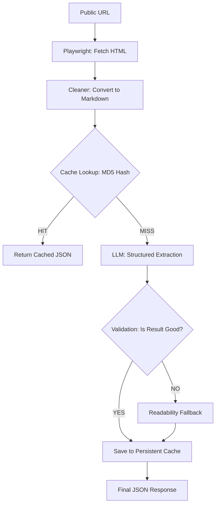

# AI Parser Microservice

A high-performance, intelligent web secondary-processing service that transforms raw webpages into structured JSON. It handles everything from complex JavaScript-heavy sites to simple articles using an AI-native approach.

---

## 🏗 Architecture Overview

The microservice is built with a pipelined approach to ensure maximum accuracy and minimum cost:

1.  **Fetcher (`fetcher.py`)**: Uses **Playwright** with a persistent browser context to load URLs. It blocks heavy resources (images, fonts, media) and ad-trackers to speed up page loads and reduce bandwidth.
2.  **Cleaner (`cleaner.py`)**: Converts raw HTML into a heavily sanitized **Markdown** format. This removes noise (scripts, styles, navigation cruft) while preserving semantic structure and media references (images, iframes).
3.  **Cache Layer (`cache.py`)**: A **Content-Aware** persistent cache. It hashes the markdown content to determine if the page has changed before calling the AI.
4.  **LLM Client (`llm_client.py`)**: Sends the structured Markdown to **GPT-4o-mini** (via OpenRouter) for intelligent field extraction.
5.  **Fallback Layer (`readability_fallback.py`)**: If the LLM output is minimal or fails, a secondary classic readability algorithm (lxml/readability) attempts to rescue the content.
6.  **Core Orchestrator (`main.py`)**: A **FastAPI** application that coordinates the flow and enforces timeouts.

---

## 🤖 AI Processing Flow

When a `/parse` request is received, the system follows this logic:



---

## 💾 Intelligent Caching

This service implements **Content-Aware Persistent Caching** designed for high-frequency scraping of dynamic pages:

-   **Hash-Based Keys**: Unlike URL-based caches, we hash the *parsed markdown content*. If a page is requested 100 times but the content hasn't changed, the LLM is only called **once**.
-   **Persistent Storage**: The cache is saved to `cache_data.json` every 10 updates and survives Docker container restarts via volume mounting.
-   **Error Protection**: The system detects "bad parses" (e.g., bot challenges, Cloudflare wrappers, 404 skins) and refuses to cache them, ensuring you don't save "trash" results.
-   **TTL**: Default cache validity is **1 hour**.

---

## 📊 Unified Response Schema

The service returns a consistent JSON object regardless of the page type:

```json
{
  "ok": true,
  "data": {
    "type": "detail",           // "detail" (article) or "list" (news feed/catalog)
    "title": "Main Headline",
    "summary": "1-2 sentence summary",
    "full_text": "Markdown-formatted body text (detail only)",
    "published_date": "YYYY-MM-DD",
    "images": [
      {
        "url": "https://...",
        "alt": "Alt text",
        "description": "Context provided by AI"
      }
    ],
    "videos": ["https://youtube.com/watch?v=...", "https://...mp4"],
    "items": [                  // Populated only for "list" pages
      {
        "title": "Entry Title",
        "url": "Entry Link",
        "snippet": "Short summary",
        "published_date": "YYYY-MM-DD"
      }
    ]
  },
  "error": null
}
```

---

## 🚀 Setup & Deployment

### Environment Variables
Create a `.env` file in the root:
```env
OPENAI_API_KEY=sk-or-v1-...
OPENAI_BASE_URL=https://openrouter.ai/api/v1
OPENAI_MODEL=openai/gpt-4o-mini
```

### Docker Deployment
The service is fully containerized. To deploy:
```bash
docker compose up -d --build
```
This will mount `./cache_data.json` as a volume to ensure cache persistence.

### Endpoints
-   `POST /parse`: `{"url": "https://..."}` - Main extraction endpoint.
-   `GET /cache/stats`: Returns count of cached entries and persistence status.
-   `POST /cache/clear`: Flushes the entire cache.

---

## 🛠 Development & Testing
-   **`test_service.py`**: Integration tests for the full pipeline.
-   **`requirements.txt`**: Python dependencies (FastAPI, Playwright, Readability).
-   **Persistent Browser**: The Playwright instance stays open across requests for sub-second start times.
